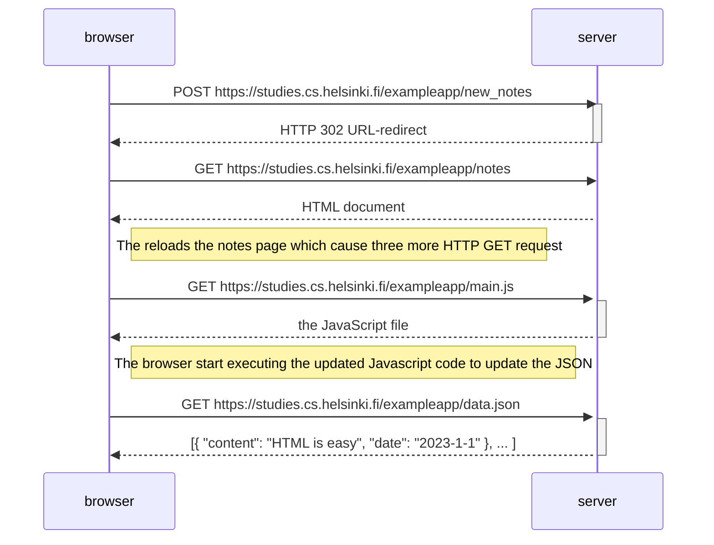
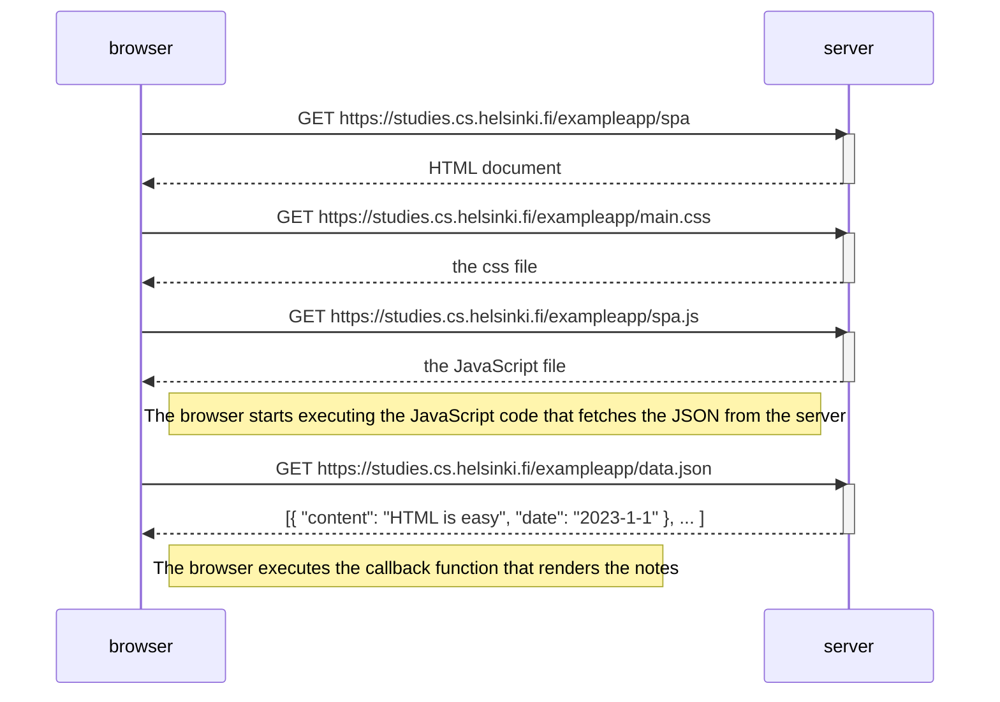
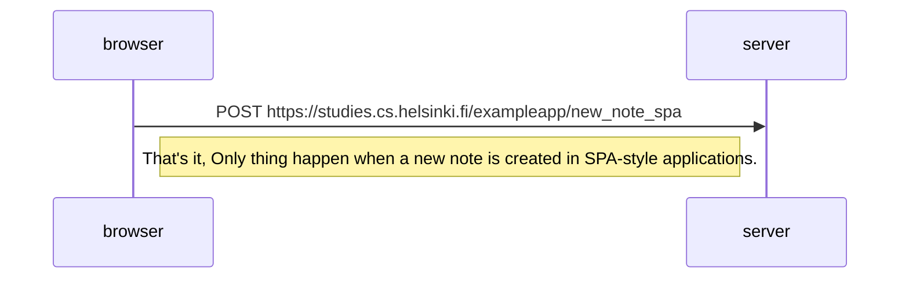

# Exercise 0.4 to 0.6

## 0.4: New note diagram

- `Mermaid-syntax` is a style to make diagram inside of Github-Markdown files to show different charts and Stats.
- When the button on the `form` is clicked, the browser will send the user input to the `server`.



## 0.5: Single Page app diagram

- SPA-style websites don't fetch all of their pages separately from the server like our sample application does, but
  instead comprise only one HTML page fetched from the server, the contents of which are manipulated with JavaScript
  that executes in the browser.



- In this style, only a single html file come from the server which get populated by the Modified `json` after the click
  on the button handled throught javascript in browser.

## 0.6: New note in Single Page app diagram

- The form has no action or method attributes to define how and where to send the input data.
- Open the Network tab and empty it. When you now create a new note, you'll notice that the browser sends only one
  request to the server.
- The POST request to the address new_note_spa contains the new note as JSON data containing both the content of the
  note (content) and the timestamp (date):

```json
{
  "content": "single page app does not reload the whole page",
  "date": "2019-05-25T15:15:59.905Z"
}
```



- here is the code which explain how everything goes in SPA-style website.

```js
var form = document.getElementById('notes_form')
form.onsubmit = function(e) {
  e.preventDefault()

    var note = {
    content: e.target.elements[0].value,
    date: new Date(),
  }

    notes.push(note)
      e.target.elements[0].value = ''
        redrawNotes()
          sendToServer(note)
}
```
